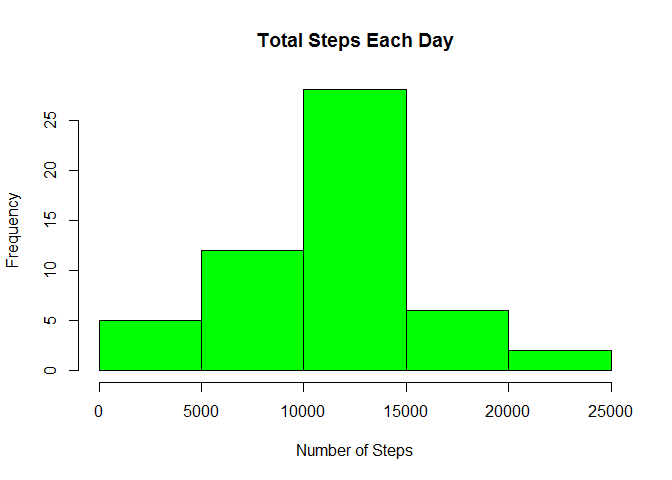
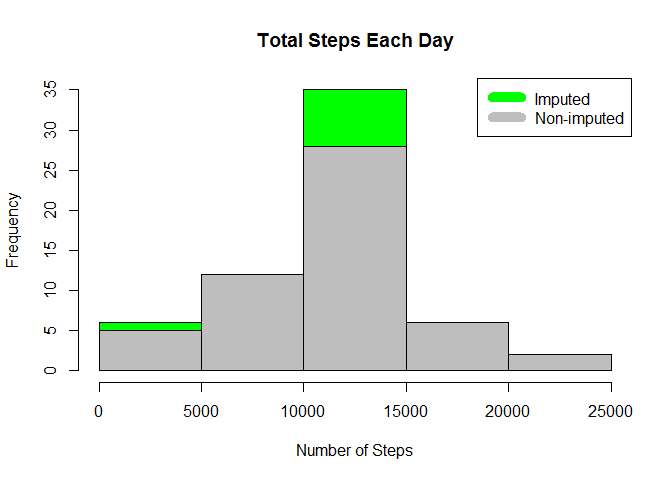

# Reproducible Research: Peer Assessment 1


## Loading and preprocessing the data


```r
activity_data <- read.csv("activity.csv")
```

## What is mean total number of steps taken per day?


```r
steps_by_day <- aggregate(steps ~ date, activity_data, sum)
hist(steps_by_day$steps, main = paste("Total Steps Each Day"), col="green", xlab="Number of Steps")
```

 

```r
r_mean <- mean(steps_by_day$steps)
r_mean
```

```
## [1] 10766.19
```

```r
r_median <- median(steps_by_day$steps)
r_median
```

```
## [1] 10765
```

# mean is r_mean and median is r_median

## What is the average daily activity pattern?
## Calculate average steps for each interval for all days.
## Plot the Average Number Steps per Day by Interval.
## Find interval with most average steps.


```r
steps_by_interval <- aggregate(steps ~ interval, activity_data, mean)

plot(steps_by_interval$interval,steps_by_interval$steps, type="l", xlab="Interval", ylab="Number of Steps",main="Average Number of Steps per Day by Interval")
```

 

```r
max_interval <- steps_by_interval[which.max(steps_by_interval$steps),1]
max_interval
```

```
## [1] 835
```

## max_interval indicates maximum number of steps on an average across all the days in the activity_data set

## Imputing missing values
## simple imputation approach was used in this assignment. Missing values were imputed by inserting the average for each interval. Thus, if interval 10 was missing on 10-02-2012, the average for that interval for all days (0.1320755), replaced the NA.


```r
incomplete <- sum(!complete.cases(activity_data))
incomplete
```

```
## [1] 2304
```

```r
imputed_data <- transform(activity_data, steps = ifelse(is.na(activity_data$steps), steps_by_interval$steps[match(activity_data$interval, steps_by_interval$interval)], activity_data$steps))
```

## As 10-01-2012 is the first day  it was imputed with zero


```r
imputed_data[as.character(imputed_data$date) == "2012-10-01", 1] <- 0
```

## Now calculate the total steps by day and create Histogram


```r
steps_by_day_i <- aggregate(steps ~ date, imputed_data, sum)
hist(steps_by_day_i$steps, main = paste("Total Steps Each Day"), col="green", xlab="Number of Steps")

## now Create another Histogram to show difference. 
hist(steps_by_day$steps, main = paste("Total Steps Each Day"), col="grey", xlab="Number of Steps", add=T)
legend("topright", c("Imputed", "Non-imputed"), col=c("green", "grey"), lwd=10)
```

 

## Calculate new mean and median with imputed data

```r
rmean_i <- mean(steps_by_day_i$steps)
rmedian_i <- median(steps_by_day_i$steps)
```

## Calculate difference between imputed and non-imputed data


```r
mean_difference <- rmean_i - r_mean
mean_difference
```

```
## [1] -176.4949
```

```r
med_difference <- rmedian_i - r_median
mean_difference
```

```
## [1] -176.4949
```
## now let us calculate the total difference


```r
total_difference <- sum(steps_by_day_i$steps) - sum(steps_by_day$steps)
```

## The imputed data mean is r rmean_i
## The imputed data median is r rmedian_i
## The difference between the non-imputed mean and imputed mean is mean_difference
## The difference between the non-imputed mean and imputed mean is med_difference
## The difference between total number of steps between imputed and non imputed data is total_difference. There were total_difference more steps in the imputed data.


## Are there differences in activity patterns between weekdays and weekends?

## Create a plot to compare and create contrast number of steps between the week days and week end


```r
week_days <- c("Monday", "Tuesday", "Wednesday", "Thursday", "Friday")
imputed_data$dow = as.factor(ifelse(is.element(weekdays(as.Date(imputed_data$date)),week_days), "Weekday", "Weekend"))

steps_by_interval_i <- aggregate(steps ~ interval + dow, imputed_data, mean)

library(lattice)

xyplot(steps_by_interval_i$steps ~ steps_by_interval_i$interval|steps_by_interval_i$dow, main="Average Steps per Day by Interval",xlab="Interval", ylab="Steps",layout=c(1,2), type="l")
```

 
